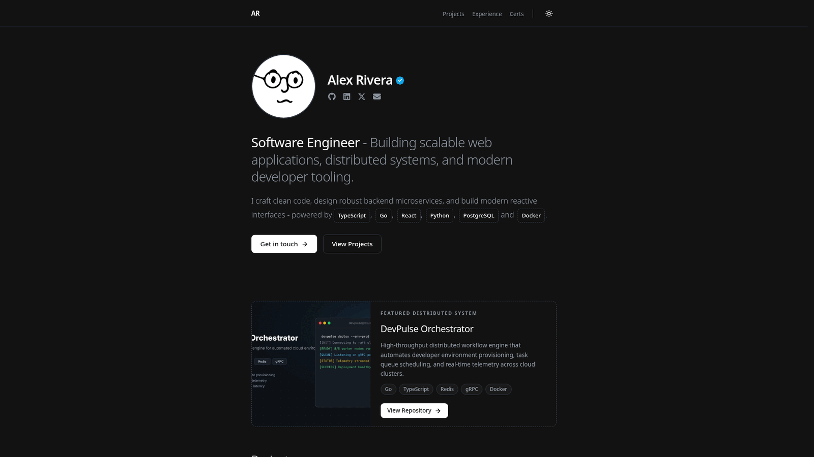

# Spotlight — Hugo Portfolio Theme

A modern spotlight-driven, high-performance personal portfolio theme engineered for software engineers, backend architects, and full-stack developers.

Zero external runtime dependencies. Zero npm packages. 100% Google Lighthouse scores. Sub-50ms build times.



---

## ✨ Features

- **⚡ Blazing Fast Build Times:** Native Hugo Pipes compilation with zero external build tools (no Node, npm, Tailwind, or Webpack required).
- **✨ Cursor Spotlight Glow:** Sleek interactive mouse-tracking spotlight gradient on featured project cards and project grid items.
- **🌓 Instant Zero-FOUC Dark/Light Mode:** Pure CSS/JS theme switcher synchronized with user system preferences (`prefers-color-scheme`) and persistent `localStorage`.
- **🚀 Out-of-the-Box Demo Mode:** Works immediately on fresh `hugo new site` installations with built-in fallback data. No empty screens!
- **📊 Interactive GitHub Activity Heatmap:** Clean, lightweight SVG contribution calendar generated automatically via the included Python utility script.
- **📱 100% Responsive Design:** Seamlessly adapts from 320px mobile screens to ultrawide desktop viewports.
- **🧩 Modular Section Toggles:** Turn sections (Spotlight, Projects, Experience, Tech Stack, Certifications, Heatmap, Contact) on or off directly from your `hugo.yaml`.
- **🔍 SEO & Social Ready:** Automatic OpenGraph meta tags, Twitter card summaries, and Schema.org JSON-LD structured data.

---

## 🚀 Quick Start

### 1. Create a New Hugo Site
```bash
hugo new site my-portfolio
cd my-portfolio
git init
```

### 2. Install the Theme
Add Spotlight as a Git submodule:
```bash
git submodule add https://github.com/kawishkamd/hugo-theme-spotlight.git themes/spotlight
```

### 3. Copy Example Site Data (Recommended)
Get started immediately by copying the demo content and configuration:
```bash
cp -r themes/spotlight/exampleSite/* .
rm hugo.toml   # Hugo uses the copied hugo.yaml
```

*(Note: Even without copying `exampleSite`, Spotlight ships with built-in demo data, so setting `theme = "spotlight"` in your `hugo.toml` works immediately!)*

### 4. Run the Development Server
```bash
hugo server -D
```
Open your browser to `http://localhost:1313/` to view your site!

---

## ⚙️ Configuration (`hugo.yaml`)

Spotlight is 100% "variable-ready". Customize everything inside your `hugo.yaml` without touching HTML:

```yaml
baseURL: 'https://example.com/'
locale: 'en-us'
title: 'Alex Rivera | Software Engineer'
theme: 'spotlight'

params:
  # Identity & Header
  author: "Alex Rivera"
  brand_text: "AR"
  role: "Software Engineer"
  hero_description: "Building scalable web applications, distributed systems, and modern developer tooling."
  hero_bio: "I craft clean code, design robust backend microservices, and build modern reactive interfaces - powered by"
  hero_chips:
    - "TypeScript"
    - "Go"
    - "React"
    - "Python"
    - "PostgreSQL"
    - "Docker"
  avatar: "/img/avatar.webp"      # Stored in static/img/
  site_image: "/img/share.jpg"     # OpenGraph share preview
  verified_badge: true             # Show verified badge next to name

  # Social Profiles (Omit any to hide icon)
  github: "https://github.com/example"
  linkedin: "https://linkedin.com/in/example"
  linkedin_name: "Alex Rivera"
  x: "https://x.com/example"
  email: "alex@example.com"

  # Section Toggles (Set to false to hide any section)
  sections:
    spotlight: true
    projects: true
    experience: true
    tech_stack: true
    credentials: true
    github_activity: true
    contact: true

  # Contact
  contact_heading: "Let's work together."
  contact_bio: "Available for full-stack engineering roles, distributed systems consulting, and technical architecture."

  # Footer
  footer_quote: "Writing clean code. Shipping reliable systems."

# Navigation Menu (Optional)
menus:
  main:
    - name: "Projects"
      url: "/projects/"
      weight: 10
    - name: "Experience"
      url: "/experience/"
      weight: 20
    - name: "Certs"
      url: "/certifications/"
      weight: 30
```

---

## 📊 Generating Your GitHub Heatmap

Spotlight includes a zero-dependency Python script to scrape your live GitHub contribution graph and output the exact JSON structure:

```bash
python themes/spotlight/tools/fetch_contributions.py <your-github-username> data/github_contributions.json
```

You can automate this in your CI/CD pipeline (e.g. GitHub Actions) to refresh your heatmap weekly or on every deployment!

---

## 📁 Managing Content & Data

All projects, work history, and credentials live in structured data files inside `data/`:

- **`data/portfolio.json`**: Holds `spotlight`, `projects`, `experience`, `credentials`, and `tags` (for the tech stack marquee).
- **`data/github_contributions.json`**: Holds the contribution matrix.

---

## 🚢 Deployment

### GitHub Pages
Add `.github/workflows/deploy.yml`:
```yaml
name: Deploy to GitHub Pages

on:
  push:
    branches: ["main"]

permissions:
  contents: read
  pages: write
  id-token: write

concurrency:
  group: "pages"
  cancel-in-progress: false

jobs:
  deploy:
    environment:
      name: github-pages
      url: ${{ steps.deployment.outputs.page_url }}
    runs-on: ubuntu-latest
    steps:
      - uses: actions/checkout@v4
        with:
          submodules: recursive
      - uses: peaceiris/actions-hugo@v3
        with:
          hugo-version: 'latest'
          extended: true
      - run: hugo --minify
      - uses: actions/upload-pages-artifact@v3
        with:
          path: ./public
      - id: deployment
        uses: actions/deploy-pages@v4
```

---

## 📄 License

Distributed under the [MIT License](LICENSE).
Built with precision by [Kawishka Dahanayaka](https://kawishkamd.github.io).
